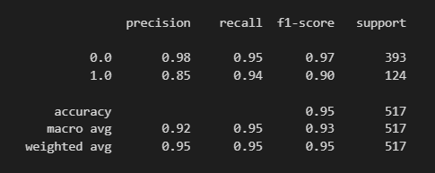
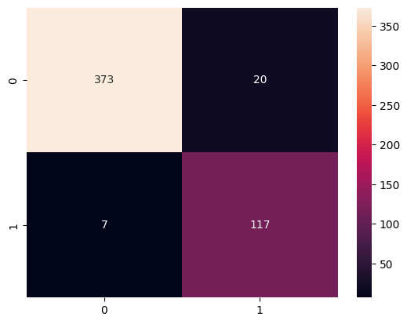
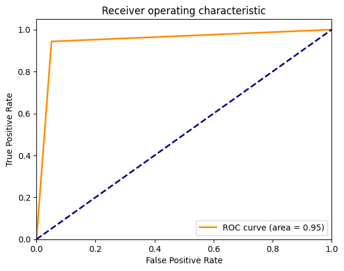
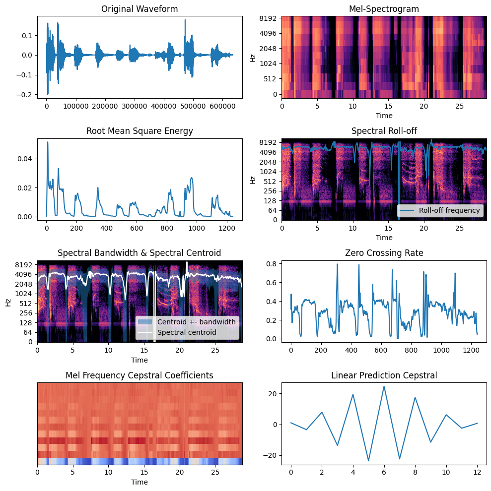

# COVID 19 DETECTION USING AUDIO AND METADATA

Dataset using in this project: https://github.com/iiscleap/Coswara-Data

In order to run the project, dataset should be downloaded and exported into **./Extracted_data**

--------
## TECH STACK
--------
- TPOT
- pandas
- numpy
- sklearn
- imbalance
- matplotlib
- seaborn
- audiomentations
- librosa

------
## FILE RUN STEP
------
1. initial_preprocessing.ipynb
2. Data_cleaning
3. data_augmentation_under_sampling
4. extract_audio_features
5. TPOT_generator

-------
## MODEL PERFORMANCE
-------

------
## AUDIO FEATURES IN THIS PROJECT
------

